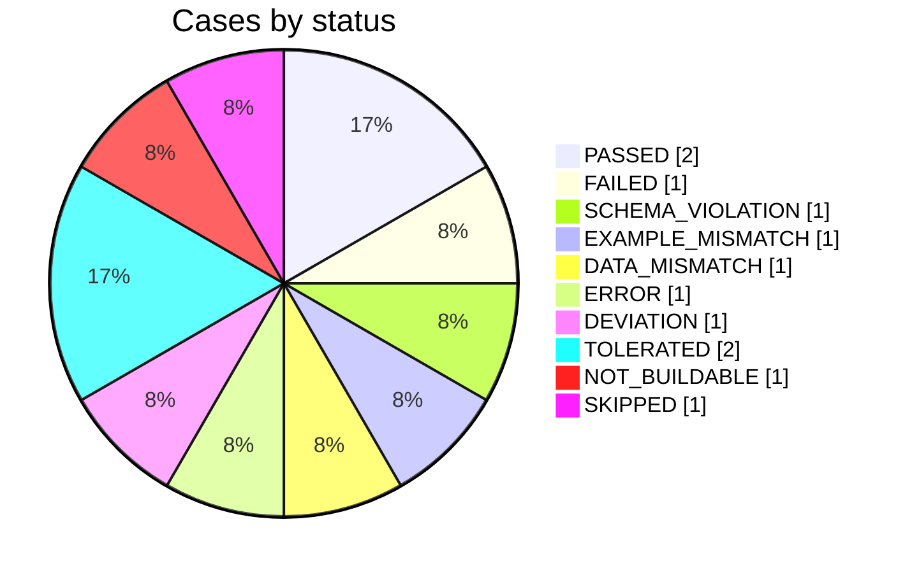

# 🧪 apitest · Bookstore 1.0

❌ **Failed** · 12 cases · ✅ 2 passed · ❌ 5 failing · 🟡 1 deviation(s) · 🟠 2 tolerated · ⏭ 2 not run · ⏱ 1.234s · 📊 3 / 4 operations

| Spec | Base URL | Started | Duration | Go / apitest | Strict |
|---|---|---|---|---|---|
| `/specs/bookstore.yaml` (OpenAPI 3.0.3) | `http://127.0.0.1:1234` | 2026-09-30T10:00:00Z | 1.234s | go1.27.1 / (devel) | yes |

2 more cases were not selected by `go test -run`.

<details open><summary><b>⚠️ Warnings (1)</b></summary>

- The spec declares a base path.

</details>

## 📈 Dashboard



| Key figure | Value |
|---|---:|
| Cases that do not fail | 5 of 10 run (50 %) |
| Cases that fail | 5 |
| Requests answered | 9 |
| Response time avg · p50 · p90 | 169 ms · 12 ms · 1.30 s |
| Response time p95 · p99 · max | 1.30 s · 1.30 s · 1.30 s |
| Time in requests · whole run | 1.53 s · 1.23 s |

### Tags

| Tag | Cases | ✅ | ❌ | 🟡 🟠 | ⏭ | Request time | Passed |
|---|---:|---:|---:|---:|---:|---:|---|
| Author | 5 | 1 | 3 | 1 | 0 | 65 ms | ██░░░░░░░░░░ |
| Book | 7 | 1 | 2 | 2 | 2 | 1.46 s | ██░░░░░░░░░░ |

### Response times

| Range | Requests | |
|---|---:|---|
| < 10 ms | 4 | ████████████████████ |
| 10–50 ms | 3 | ███████████████░░░░░ |
| 100–250 ms | 1 | █████░░░░░░░░░░░░░░░ |
| 1–2.5 s | 1 | █████░░░░░░░░░░░░░░░ |

### Status codes

| Code | Answers | |
|---|---:|---|
| 🟢 200 | 3 | ████████████████████ |
| 🟢 201 | 2 | █████████████░░░░░░░ |
| 🟢 204 | 1 | ███████░░░░░░░░░░░░░ |
| 🟠 404 | 2 | █████████████░░░░░░░ |
| 🔴 500 | 1 | ███████░░░░░░░░░░░░░ |

### Slowest requests

| # | Case | Request | Code | Time | |
|---:|---|---|---:|---:|---|
| 1 | `Book/updateBook/default` | `PUT /books/1` | 200 | 1.30 s | ████████████ |
| 2 | `Book/getBook/default` | `GET /books/1` | 200 | 130 ms | █░░░░░░░░░░░ |
| 3 | `Author/createAuthor/valid` | `POST /authors` | 201 | 42 ms | █░░░░░░░░░░░ |
| 4 | `Book/createBook/conflict` | `POST /books` | 500 | 21 ms | █░░░░░░░░░░░ |
| 5 | `Author/createAuthor/mismatch` | `POST /authors` | 201 | 12 ms | █░░░░░░░░░░░ |
| 6 | `Author/createAuthor/wrong` | `POST /authors` | 200 | 8 ms | █░░░░░░░░░░░ |
| 7 | `Book/deleteBook/not-found` | `DELETE /books/999999999` | 204 | 6 ms | █░░░░░░░░░░░ |
| 8 | `Book/getBook/not-found` | `GET /books/999999999` | 404 | 5 ms | █░░░░░░░░░░░ |
| 9 | `Author/getAuthor/default` | `GET /authors/1` | 404 | 3 ms | █░░░░░░░░░░░ |

## 🎯 Error cases

3 error cases: **1 as documented**, **2 other** (tolerated with `TolerateErrorCases`, they do not fail the test).

| Expected ↓ · received → | 204 | 404 | 500 |
|---|---:|---:|---:|
| **404** | ⚠️ 1 | ✅ 1 | · |
| **409** | · | · | ⚠️ 1 |

| Case | Kind | Request | Expected | Received | Result | Answer |
|---|---|---|---:|---:|---|---|
| `Book/getBook/not-found` | not-found | `GET /books/999999999` | 404 | 404 | ✅ as documented |  |
| `Book/deleteBook/not-found` | not-found | `DELETE /books/999999999` | 404 | 204 | 🟠 tolerated (FAILED) | `tolerated (FAILED): status code 204, expected 404` |
| `Book/createBook/conflict` | conflict | `POST /books` | 409 | 500 | 🟠 tolerated (FAILED) | `{ "message": "duplicate key <script>" }` |

<details><summary><b>📊 Coverage: 3 of 4 operations (75 %)</b></summary>

| | Covered | Total | |
|---|---:|---:|---|
| Operations with an executed case | 3 | 4 | ███████████████░░░░░ 75 % |
| Named examples executed | 1 | 2 | ██████████░░░░░░░░░░ 50 % |

| Uncovered operation | Reason |
|---|---|
| `upload` | media type not supported |

</details>

<details><summary><b>🔎 Spec findings (1)</b></summary>

| Location | Finding |
|---|---|
| `paths./x.get` | example does \| not match |

</details>

<details open><summary><b>❌ Errors (5)</b></summary>

### ❌ Author/createAuthor/wrong — FAILED

| | |
|---|---|
| Request | `POST /authors` |
| Expected | 201 |
| Actual | 200 |
| Time | 8 ms |

expected 201, got 200

<details><summary>Request</summary>

```json
{
  "name": "Ada"
}
```
</details>

<details><summary>Response (200)</summary>

```json
{}
```
</details>

<details><summary>Reproduce</summary>

```bash
curl -X POST "$BASE_URL/authors" -H "Authorization: Bearer $TOKEN" -d '{"name":"Ada"}'
```
</details>

### ❌ Book/getBook/default — SCHEMA_VIOLATION

| | |
|---|---|
| Request | `GET /books/1` |
| Expected | 200, Schema |
| Actual | 200 |
| Time | 130 ms |

response violates the schema

**Schema errors**

- /price: value must be a number

### ❌ Author/createAuthor/mismatch — EXAMPLE_MISMATCH

| | |
|---|---|
| Request | `POST /authors` |
| Expected | 201, body ⊇ example |
| Actual | 201, body differs |
| Time | 12 ms |

response differs from the example

**Differences**

| Pointer | Expected | Actual |
|---|---|---|
| `/name` | `"Ada"` | `"Bob"` |
| `/x` | `1` | `(missing)` |

### ❌ Book/updateBook/default — DATA_MISMATCH

| | |
|---|---|
| Request | `PUT /books/1` |
| Time | 1.30 s |

GET returns different values

<details><summary>Response</summary>

```text
aaaaaaaaaa
```

*Truncated, original size 70000 bytes.*
</details>

<details><summary>Response (GET /books/1, 200)</summary>

```json
{
  "title": "Go"
}
```
</details>

### ❌ Author/listAuthors/default — ERROR

| | |
|---|---|
| Request | `GET /authors` |

timeout after 1s

</details>

<details open><summary><b>🟡 Deviations (1)</b></summary>

Entries of `/specs/deviations.yaml`:

| # | Case | Deviation | Reason | Ticket | Valid until | Used | State |
|---:|---|---|---|---|---|---:|---|
| 1 | `Author/getAuthor/default` | 200 → 404 | seed data missing | API-1 | 2026-12-31 | 1 | active |
| 2 | `Book/*/default` | EXAMPLE_MISMATCH at /title | trimmed |  | 2026-10-05 | 1 | ⚠️ expires soon |
| 3 | `Shelf/*/default` | 404 → 500 | old |  | 2026-01-01 | 0 | ❗ expired |
| 4 | `X/y/z` | 400 → 200 | unused |  | 2027-01-01 | 0 | unused, can be removed |

### 🟡 Author/getAuthor/default — DEVIATION

| | |
|---|---|
| Request | `GET /authors/1` |
| Time | 3 ms |

allowed by API-1

</details>

<details><summary><b>🟠 Tolerated error cases (2)</b></summary>

### 🟠 Book/deleteBook/not-found — TOLERATED

| | |
|---|---|
| Request | `DELETE /books/999999999` |
| Expected | 404 |
| Actual | 204 |
| Without tolerance | `FAILED` |
| Time | 6 ms |

tolerated (FAILED): status code 204, expected 404

### 🟠 Book/createBook/conflict — TOLERATED

| | |
|---|---|
| Request | `POST /books` |
| Expected | 409 |
| Actual | 500 |
| Without tolerance | `FAILED` |
| Time | 21 ms |

tolerated (FAILED): status code 500, expected 409

<details><summary>Response (500)</summary>

```json
{
  "message": "duplicate key <script>"
}
```
</details>

</details>

<details><summary><b>⏭ Not run (2)</b></summary>

| Case | Status | Reason |
|---|---|---|
| `Book/upload/default` | `NOT_BUILDABLE` | no value for /file |
| `Book/deleteBook/default` | `SKIPPED` | x-apitest-skip: later |

</details>

<details><summary><b>✅ Passed (2)</b></summary>

| Case | Request | Status | Time |
|---|---|---|---:|
| `Author/createAuthor/valid` (precondition) | `POST /authors` | 201 | 42 ms |
| `Book/getBook/not-found` | `GET /books/999999999` | 404 | 5 ms |

</details>

